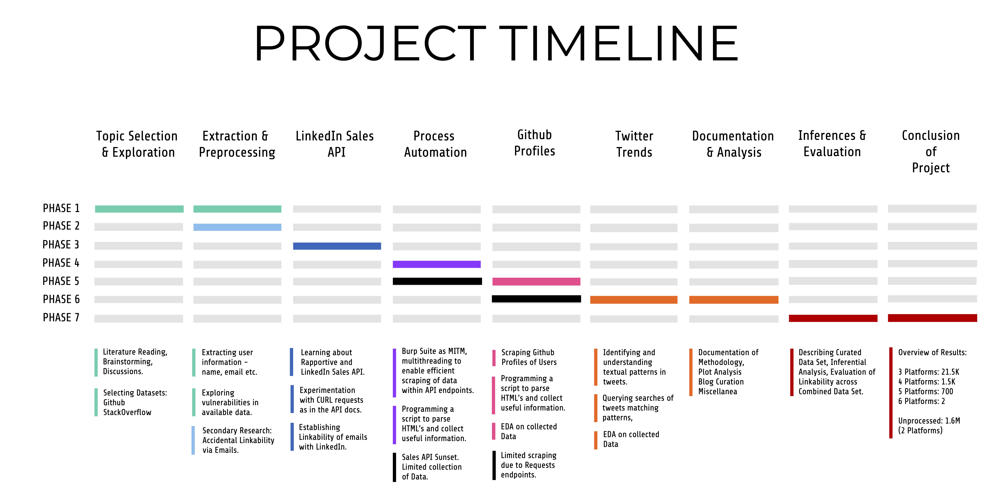
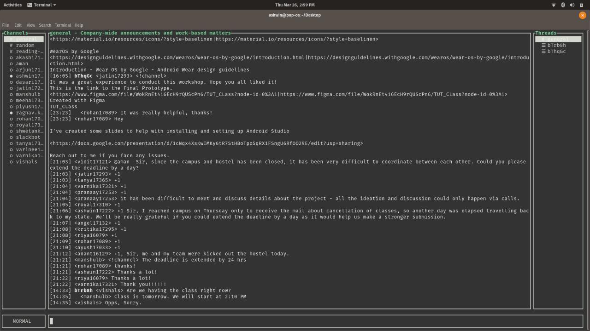
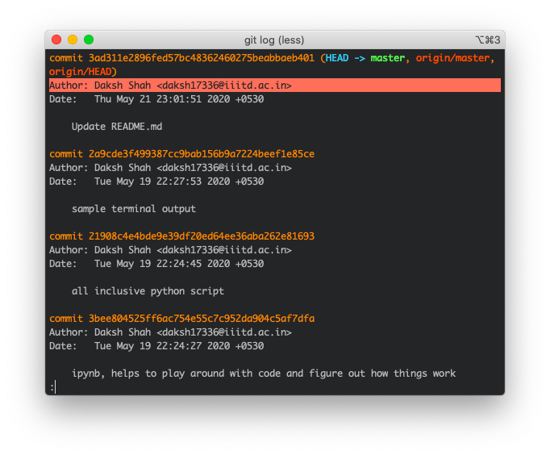
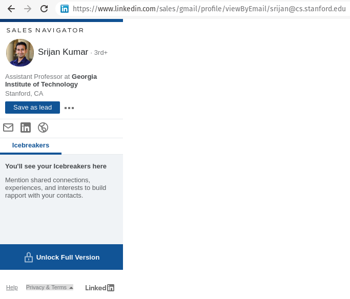
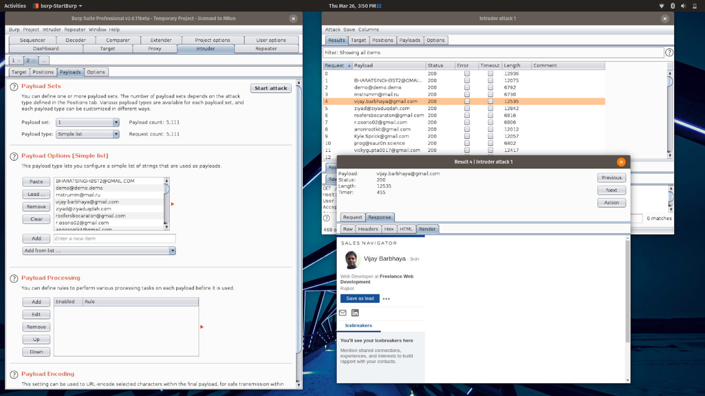
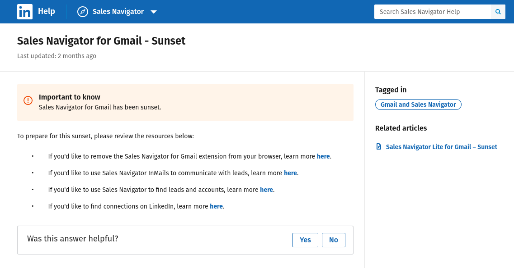
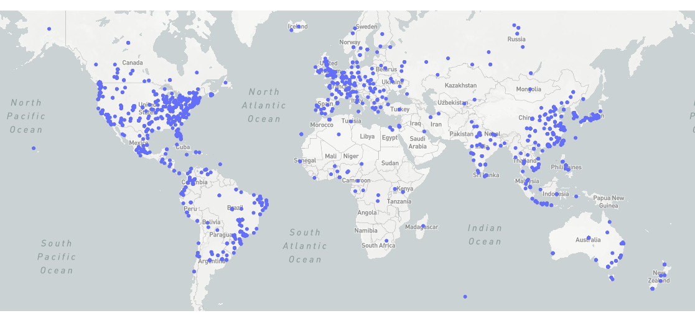
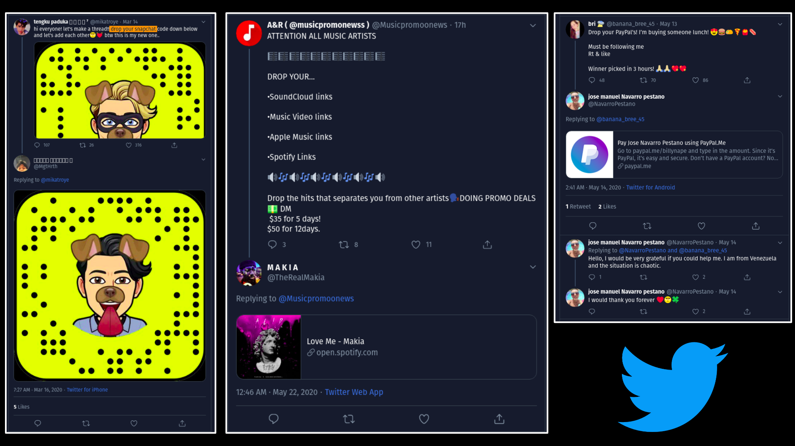
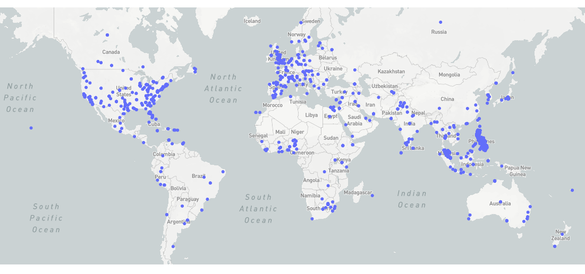
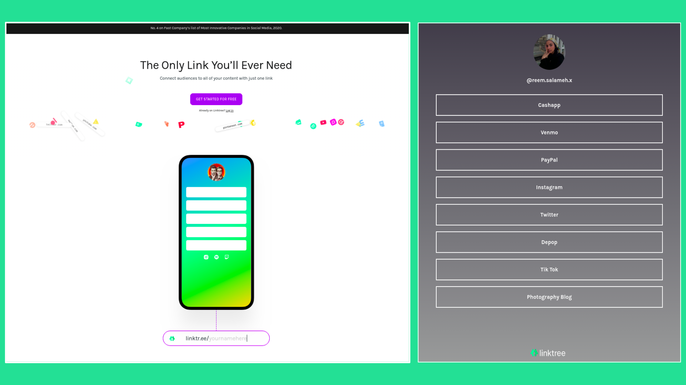

# ForgetMeNot: Exploring Accidental Linkability of Users

## A case study on GitHub, StackOverflow, and Twitter

## Our Team

## Introduction

Online Social Networks (OSNs) have experienced exponential growth in recent years. They have a significant presence in both the personal and professional lives of a vast segment of the world's populace.
Any content or personal information that an individual shares on any social network can be traced back to him/her even after it has been removed. It is rightly said that 'Nothing is ever lost on the internet.'

Unsurprisingly, OSNs are subject to severe privacy and security risks. Due to the amount of personally identifiable information shared by users in OSNs and lack of adequate privacy settings, it becomes possible to aggregate data about users by linking their profiles across several online social networks.

For our project, we decided to explore this accidental linkability by exploiting privacy and security issues associated with users' OSNs and behavioral tendencies.

We started with accessing publicly available data, collecting personally identifiable information (PII) on the users, followed by varied attempts to link them to accounts on different OSNs.

## Timeline

## Initial Idea: Exploring accidental release of API Keys

While doing the assignments in this course, we noticed that many developers on Github forget to remove API keys (for their social network accounts such as Twitter and Slack). To confirm this, we manually searched GitHub and found some lists of Twitter API keys. After curating them together, we were able to get roughly 300 unique Twitter API keys, out of which around 200 were valid and working keys. The problem was fascinating since there were a lot of security and privacy-related aspects to it. These keys could be used to collect more data per unit time (for networks that throttle with rate limits per account). More interestingly, in some cases, can give a stranger complete access to another user's Twitter account (which would be a gross breach of security and privacy). Hence, we decided to attempt at extracting such API keys from GitHub commits (and StackOverflow data).

Initially, we used a regex of Slack API keys to find such keys in the GitHub commits and StackOverflow data. Once we got these API keys, we needed a way to test them and use them. Hence we set up a terminal utility (written in Golang). This utility took the Slack API key as input and opened a terminal interface for that user. Using this, we had complete control over the user's account where we could even send messages from the account. This was a gross breach of security and privacy that we were able to exploit. Here's an example:

## GitHub Email Vulnerability

When setting up `git` for the first time on your laptop/machine, a user is required to set a Name and an Email before making a commit. These are generally set by a command similar to `git config --global user.email "email@example.com"`. Users often do not wonder about the repercussions; this may have a few years later in the future. For example, when pushing commits to your public repository on GitHub, you are attaching this set name+email (in plaintext) along with. 

Don't take our word for it. Test it out! 
1. Clone any public repository (eg. `git clone https://github.com/Daksh/process-github-daily-dumps.git`)
2. Navigate inside this repository using terminal (eg. `cd process-github-daily-dumps`)
3. Check the commits using `git log`

Voila! You will find the user mentioned email address along with each commit.

We decided to use this interesting observation to see the magnitude of this potentially unintentional breach of privacy. To operationalize this experiment, We downloaded daily dumps of GitHub data for May and June (2019). Each daily-dump was about 5-7 GB's on average in its zipped form. Due to computational restrictions, processing the data was a challenge for us. To overcome this difficulty, we automated the following steps of the process:

+ Download the daily dump (`.zip`)
+ Extract the `.bson` files from the zip
+ Import select `.bson` files to the Mongo database
+ Run a `.py` script to extract information from the Mongo database
+ Cleanup

**We have publically released this automation code on Github, at <https://github.com/Daksh/process-github-daily-dumps>.**

The following information on the users was collected from the data mentioned above:

+ Github Profile
+ Name
+ Organisation
+ Email
+ Avatar
+ Site Admin Status

## StackOverflow Email and Phone Number Vulnerability

StackOverflow releases its complete data regularly. We used one of these dumps from <https://archive.org/details/stackexchange>, and processed the "About Me" section of users. 

Often users put out their emails and phone numbers in their About Me, hoping for humans looking at their profile to be able to reach out to them. This opens them to the possibility of a script being able to gather all such data and potentially misuse it. 

We found the following PII(s):
+ StackOverflow Profile
+ Name
+ Email (9,411 email ids)
+ Phone Number (933 phone numbers)
+ Avatar [Profile Photo]

## Using the Collected Data

From the data collected above, we decided to make use of the email ids of users and find the possible social media platforms on which their accounts can be linked. We started with an exploration of the information we could get for a user using their email on platforms like LinkedIn, Twitter, Facebook, and Instagram.

### LinkedIn Sales API

We came across an old chrome extension `Rapportive` which would return the **LinkedIn** profile for given email id (provided that an associated LinkedIn account exists).

We found out that this extension was eventually acquired by LinkedIn and integrated into their sales API. Then, we looked at the documentation of their API and found that the CURL request for the sales API was of the form: 

> `https://www.linkedin.com/sales/gmail/profile/viewByEmail/`

We opened this given URL directly in our browser upon suffixing it by a valid email:

> `https://www.linkedin.com/sales/gmail/profile/viewByEmail/abc@gmail.com`

The resulting webpage looked like the following:

We decided to proceed by scraping data from the page that was returned by this URL. However, we encountered another challenge. For the above request to work, we needed to be logged into a LinkedIn account, which wasn't feasible while using a scraper programmatically.

To overcome this, we used Burp Suite - it acts as a Man in the Middle (MITM) between our web browser and the internet. We used it to analyze the GET request made to the above URL. We could now repeat the same request with the same headers but different payload (email) to get user information. As only authenticated LinkedIn users are allowed to use this API, we needed authentication tokens (from headers) to automate the whole process (using Burp Suite).

From the output, we scraped the entire HTML and parsed it to collect more information. In addition to their LinkedIn Profiles, we also collect the following information:

+ Profile Photo
+ Job Title
+ Organization
+ Location
+ Other links (Twitter, Facebook etc.)

While we had started collecting data using this methodology, shortly after, the **LinkedIn Sales API** feature was sunset. Hence, we could only obtain the information for a subset of the users in our dataset.

### Analysis

We made an **Image Grid** to get an understanding if the profiles collected are genuine or not.

Note: There did not exist a tool to create such an interactive grid, hence we wrote the script ourselves. **We have publically released this tool on Github, (at <https://github.com/Daksh/Interactive-Image-Grid>).**

<iframe id="imageGrid" scrolling="no" style="border:none;" seamless="seamless" src="linkedIn_profile_images_grid.html" height="525" width="100%"></iframe>

We made **Word Clouds** to see the most prominent working titles of users and organizations where they worked at:

 

We also plotted the locations of the users on a Map to profile our demographic further.

We scraped links to other platforms from a user's Linekdin profile and found the following distribution of linked platforms through the LinkedIn Data:

<iframe id="igraph" scrolling="no" style="border:none;" seamless="seamless" src="plots/LinkedInData.html" height="525" width="100%"></iframe>

## Syncing Google Contacts

To try and link accounts on more online platforms, we decided to make use of the `Sync Contacts` feature on popular OSM's such as Facebook, Instagram, and Twitter.

We made VCFs (virtual contact file) containing names and email ids for a significant proportion of users in our data and added them to a newly created dummy Google Account. The first difficulty we faced here was that Google Contacts only allowed adding a limited number of contacts at a time despite the limit being 25k.

When we tried syncing these contacts on Facebook, Instagram, and Twitter, we ran into the following problems:

+ **Facebook** - Post syncing of the contacts, we did get suggestions for people in our contact list. However, they also contained other random people from outside our contacts. Another challenge here was that the output page only loaded a limited number of profiles at a time and required scrolling the page to load more results. This wasn't programmatically possible.
+ **Instagram** - Earlier Instagram had a feature where one could sync their Google Contacts and follow them on Instagram, but that feature did not exist anymore. Even after syncing the contacts, the suggestions were minimal and mixed.
+ **Twitter** - Despite successfully syncing the contacts, Twitter could not find the profile of people in our contact list or suggest their twitter accounts.

As a result, we were not successful in this approach.

## Getting to know our GitHub users more

To extend our PII search on GitHub, we scraped the profiles of the users whose emails we found in the GitHub Daily Dumps. Upon doing this, we got to know these fields about each of the users:

+ Personal URL 
+ Location
+ Organization 
+ Bio

To avoid getting blacklisted by GitHub (or overload them with too many requests), we sent a throtlled number and hence we were able to do this process for 32k/1.6m users.

## Finding linkability on Twitter

We came across an interesting Twitter trend, where users post tweets asking for their followers' profiles on other social networks. They ask for various profiles such as Instagram, Soundcloud, Paypal, etc. so they could add them as friends on that platform, promote their content, or donate small amounts of money to them (e.g. paying for their lunch).

### Data Collection

We decided to collect this data by querying searches of the form" `drop your <platform_name>`" on Twitter. We considered the following platforms for the collection of this data:

+ Instagram
+ Snapchat
+ Spotify
+ Soundcloud
+ Venmo
+ Paypal

We used Twint (an advanced Twitter scraping tool written in python) to retrieve tweets using such queries.

Interestingly, we noticed an increased number of such tweets since lockdowns (commenced due to COVID). We did a time-series analysis on all tweets containing our queries to confirm the same.

<iframe id="igraph" scrolling="no" style="border:none;" seamless="seamless" src="plots/TweetTimeSeries.html" height="525" width="100%"></iframe>

<iframe id="igraph" scrolling="no" style="border:none;" seamless="seamless" src="plots/TweetTimeSeriesCF.html" height="525" width="100%"></iframe>

As visible from the graph, there is an increase in the slope post the commencement of lockdown periods in countries majorly affected by COVID, denoting higher usage periods of social media in those countries due to reduced in-person interactions. We also plotted the locations of these users:

Once such tweets were retrieved, we decided to use the Twitter API to get the replies to such tweets. The twitter API itself does not have a feature for querying replies to a tweet. We worked our way around by querying the mentions of the users who posted the original tweet and checking if those mentions were in replies to the tweets we initially stored. However, this only gave us recent mention-containing tweets (due to the API endpoint restrictions). Because of this, we were restricted to scraping tweets only from the past 24 hours.

We continued collecting this data for five days and got good results. 
For Snapchat, we retrieved the snapcodes that users had shared instead of any Snapchat links in the replies. These snapcodes are unique to only one profile and hence can be considered as PII for a user. Following is a collage of the snapcodes we collected from the images embedded in replies to the tweets:

 

We parsed the collected replies for possible links of their accounts on these platforms. While parsing these, we also collected any URLs that the users had linked in their profile or bio to enable linking to more platforms. This process yielded the following distribution of linked platforms:

<iframe id="igraph" scrolling="no" style="border:none;" seamless="seamless" src="plots/TwitterReplies.html" height="525" width="100%"></iframe>

**The graph shows that in just five days, we were able to collect around 15,000 social network profiles for different Twitter users**. If this process of scraping tweet replies is carried out over a longer time, we expect to have link a sizable number of Twitter users to at least one other social network, if not more.

### Insights

We plotted a graph with the followers and following of the users who were the ones replying to such tweets:

<iframe id="igraph" scrolling="no" style="border:none;" seamless="seamless" src="plots/FollowerFollowing.html" height="525" width="100%"></iframe>

+ Top 5% of the Users have 10.5k or more followers.
+ Top 25% of the Users have 1.5k or more followers.
+ Proportion of Users with low # of followers is more than Users with a high # of followers.

We found an interesting platform **Linktree**, which was linked to the twitter profiles of such users. Linktree allows users to curate a one-stop page to connect all their OSN accounts. Here, we noticed users adding all their social media links so that their audience can access them on one page. 

We found no previous research on this platform and read online that it comprises of roughly 3 million users. We feel that this platform might be ideal for future research on linkability since it has no limits on scraping and compromises the links to multiple user accounts.

## Conclusion + Evaluation

This graph represents all the users we were able to link via Twitter replies and it gives the distribution of the number of platforms we were able to link them on:

<iframe id="igraph" scrolling="no" style="border:none;" seamless="seamless" src="plots/LinkabilityTwitter.html" height="525" width="100%"></iframe>

This graph represents all the users we were able to link via their LinkedIn profiles, which were found out by using their email ids retrieved from StackOverflow and a part of GitHub data, and it gives the distribution of the number of platforms we were able to link them on:

<iframe id="igraph" scrolling="no" style="border:none;" seamless="seamless" src="plots/LinkabilityLinkedIn.html" height="525" width="100%"></iframe>

This graph is a cumulative representation of all the users we were able to link via different source platforms, and it gives the distribution of the number of platforms we were able to link them on. We were unable to process all the GitHub data to find the LinkedIn profiles for users since the LinkedIn sales API was sunset soon after we discovered it, and hence the unprocessed GitHub data has been represented separately:

<iframe id="igraph" scrolling="no" style="border:none;" seamless="seamless" src="plots/Linkability.html" height="525" width="100%"></iframe>

We can see that it is straightforward to link a user on two platforms, but it keeps getting tougher to link the user on more platforms.

In 3 months with limited resources, we were able to link roughly 1.7 million user profiles across a minimum of 2 platforms and a maximum of 5 platforms from a tiny part of publically available data on the internet. It is very clear from the dataset that we have been able to create, that users are often careless with what they share online and most likely forget about all the personal information that they have put out there. It has become easy to link one person on a particular platform to other profiles on different OSNs. This makes it possible to profile an individual and hence breach his/her privacy and security online. 

## References

* <https://www.sciencedirect.com/science/article/abs/pii/S2468696417300332`>
* <https://ieeexplore.ieee.org/abstract/document/5510913?casa_token=hYekQX0-bnIAAAAA:TIlYOLsXVRkH26cMlJC3ZRyP1LxsEGBSnkNGqCVwu0AHgkQXOU3xZGDZpjl1-S07dtgjIvumMrR9>
